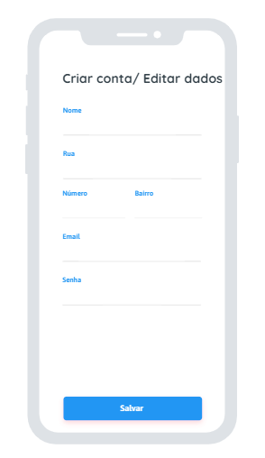
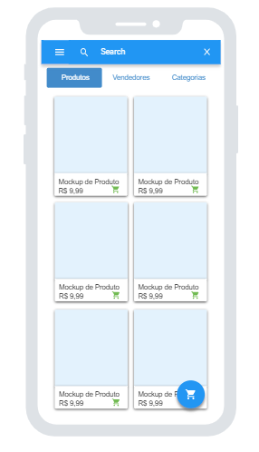
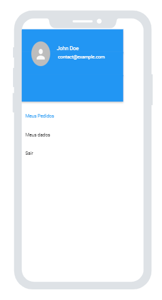
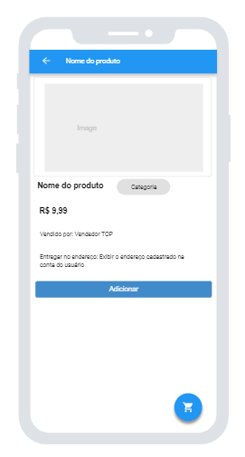

<h1 align="center">
<br>
  
<br>
<br>
React Native Application for Ecommerce
</h1>

<p align="center">Ecommerce desenvolvido com projeto final do curso de React Native do Projeto UNIFAP Digital 4.0</p>

<p align="center">
  <a href="https://opensource.org/licenses/MIT">
    
  </a>
  <a href="https://www.linkedin.com/in/devtucuju/" target="_blank" rel="noopener noreferrer">
    
  </a>
</p>

<p align="center">
  <a href="#-about-the-project">About the project</a>&nbsp;&nbsp;&nbsp;|&nbsp;&nbsp;&nbsp;
  <a href="#-technologies">Technologies</a>&nbsp;&nbsp;&nbsp;|&nbsp;&nbsp;&nbsp;
  <a href="#-getting-started">Getting started</a>&nbsp;&nbsp;&nbsp;|&nbsp;&nbsp;&nbsp;
  <a href="#-how-to-contribute">How to contribute</a>&nbsp;&nbsp;&nbsp;|&nbsp;&nbsp;&nbsp;
  <a href="#-license">License</a>
</p>

[//]: # (Add your gifs/images here:)
<div  style="
display:grid;
grid-template-columns: 250px 250px 250px;
gap:10px
" >
  
  
  
  
</div>


<hr />

## 💇 About the project

Soon
To see the **api**, click here: [Ecommerce API](./server.json)</br>

## 🚀 Technologies
[//]: # (Add the features of your project here:)
This app features all the latest tools and practices in mobile development!

- **React Native 0.69.4** - (https://reactnative.dev/)
- **Expo 46** - (https://expo.dev/)
- **React Navigation** - (https://reactnavigation.org/)
- **Axios** - (https://github.com/axios/axios)

## 💻 Getting started

### Requirements

- **NodeJs** - (https://nodejs.org/en/) - this project uses node version 14

**Clone the project and access the folder**

https
```bash
$ git clone https://github.com/devtucuju/react-native-ecommerce.git && cd react-native-ecommerce
```
or
ssh
```bash
$ git clone git@github.com:devtucuju/react-native-ecommerce.git && cd react-native-ecommerce
```


**Follow the steps below**

```bash
# Install the dependencies
$ npm install  or yarn install

# Start the project
$ npx expo start or expo start

# Read QrCode with expo go for android or the camera para ios
```

## 🤔 How to contribute

**Make a fork of this repository**

```bash
# Fork using GitHub official command line
# If you don't have the GitHub CLI, use the web site to do that.

$ gh repo fork devtucuju/react-native-ecommerce
```

**Follow the steps below**

```bash
# Clone your fork
$ git clone your-fork-url && cd react-native-ecommerce

# Create a branch with your feature
$ git checkout -b my-feature

# Make the commit with your changes
$ git commit -m 'feat: My new feature'

# Send the code to your remote branch
$ git push origin my-feature
```

After your pull request is merged, you can delete your branch


## 📝 License

This project is licensed under the MIT License - see the [LICENSE](https://opensource.org/licenses/MIT) page for details.

Powered with 💜 by Júnior Silva 👋 [See my linkedin](https://www.linkedin.com/in/devtucuju/)

Liked? give the repository a star!